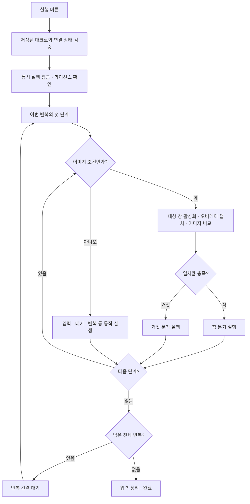

# 매크로 동작 순서

현재 코드 기준 문서. 블록 편집, 이미지 포함 import/export, 대상 창 입력 경로를 설명한다.

## 1. 새 매크로 설정 순서

1. **새로 만들기**를 누르고 이름을 입력한다.
2. **창 새로고침** 후 대상 프로그램을 선택한다. 프로세스 이름·실행 경로·창 제목을 함께 저장한다.
3. **오버레이 영역 설정**을 누른다. 대상 창을 활성화하고 현재 보이는 클라이언트 영역을 캡처한다. 정밀한 영역이 필요 없으면 **전체 창 자동 설정**으로 클라이언트 전체를 96 DPI 좌표로 바로 지정할 수 있다.
4. 정지된 캡처 화면에서 영역을 드래그하고 Enter로 확정한다. Esc는 취소한다.
5. 창 내부의 96 DPI 논리 좌표로 오버레이를 자동 저장한다.
6. **영역 안에서 이미지 캡처**로 기준 이미지를 선택한다. 이미지와 미리보기를 암호화 저장한다.
7. 캡처 보관함의 이미지를 선택하고 **선택 이미지 조건 추가**를 누른다.
8. 블록 편집 공간에서 조건의 검사·참·거짓 및 반복 안에 동작을 연결한다.
9. 전체 반복 횟수와 간격을 정하고 저장한다.
10. **입력 없이 미리보기**로 흐름을 확인하거나, 라이선스가 준비된 상태에서 **실행**한다.

**저장 오버레이 표시**는 대상 창 이동에 따라 테두리를 갱신한다. 테두리는 마우스 입력을 통과시키고 검색 영역 바깥에 그린다. 테두리를 숨겨도 저장된 영역에서 탐지한다.

## 2. Scratch 방식 블록 편집

Blockly의 연결형 블록을 사용한다. 왼쪽 목록에서 블록을 끌어 **실행 버튼을 눌렀을 때** 블록 안에 연결한다.

| 블록 목록 | 지원 동작 |
| --- | --- |
| 입력 | 키 조합, 문자, 클릭, 마우스 이동, 스크롤 |
| 이미지 탐지 | 이미지 검사, 발견 대기, 발견한 이미지 클릭 |
| 조건과 반복 | 이미지 조건의 참·거짓, 반복, 이미지 재시도, 대기, 중지 |

- 연결 순서가 실행 순서다. 조건과 반복 안에 블록을 중첩할 수 있다.
- 블록을 끌어서 위치를 바꾸고, 우클릭 메뉴와 휴지통으로 복제·삭제한다.
- 조건의 검사 칸에는 이미지 검사 블록 하나, 재시도에는 이미지 동작 하나를 연결한다.
- 시작 블록에 연결하지 않은 블록이 있으면 저장과 실행을 막고 연결을 안내한다.
- 이미지 블록에서 캡처 이미지를 이름으로 선택한다. 저장된 오버레이가 있으면 그 영역을 우선 사용한다.
- 클릭과 이동은 **오버레이** 또는 **창 영역** 좌표 기준을 선택할 수 있다.
- 실행 중인 블록을 강조한다. 조건 분기의 참·거짓 경로도 별도로 표시한다.
- **상세 목록으로 보기**로 기존 편집 화면을 사용할 수 있다.
- 저장 형식은 기존 version 2의 `actions`를 유지한다. 예전 매크로도 블록으로 불러온다.
- 별도의 생성 JavaScript를 실행하지 않는다. 블록을 검증된 `actions`로 변환하여 기존 실행 엔진에 전달한다.
- `script` 문자열은 보관하며, 실행 버튼은 `actions`를 실행한다.

## 3. 내보내기와 가져오기

### 내보내기

1. 선택한 매크로의 변경사항을 저장한다.
2. **매크로 내보내기**를 누른다.
3. 이미지 보관함과 중첩된 모든 이미지 블록의 참조를 모은다.
4. 앱 이미지 저장소는 복호화하고, 외부 이미지 파일도 읽어 PNG로 정규화한다.
5. 파일 경로를 패키지 내부 자산 ID로 치환한다.
6. 기존 창 기준 클릭이 오버레이 안에 있으면 오버레이 기준 좌표로 변환한다.
7. 설정과 이미지 데이터를 하나의 `.amacro` 파일로 저장한다.

패키지에는 로컬 저장소 키나 라이선스를 넣지 않는다. 공유 가능한 파일이므로 설정과 PNG 데이터가 읽을 수 있는 JSON/base64로 들어간다. 가져올 PC에 종속적인 실행 파일 경로와 시작 단축키는 제거한다.

### 가져오기 후 연결

1. **매크로 가져오기**에서 `.amacro`를 선택한다.
2. 패키지 버전, 크기, 이미지 디코딩, ID 중복, 자산 참조, 액션 구조를 검증한다.
3. 새로운 매크로 ID를 만들고 이미지들을 이 PC의 키로 다시 암호화한다.
4. 각 블록의 이미지 참조를 새 로컬 경로로 연결하고 기존 목록에 추가한다.
5. 대상 프로세스·창 제목을 확인한다. 필요하면 **창 새로고침**으로 다시 선택한다.
6. **오버레이 영역 설정**으로 새 영역을 지정한다.
7. 영역 크기가 같고 창 기준 외부 좌표가 없으면 재연결이 완료된다.
8. 검토 안내가 있으면 이미지 크기와 클릭 좌표를 수정하고 **이미지와 좌표 검토 완료**를 누른다.
9. 저장 후 실행한다. 가져오기 자체는 매크로를 실행하지 않는다.

검증 실패는 기존 매크로를 변경하지 않는다. 이미지 저장 후 문서 저장이 실패하면 이번 가져오기에서 만든 이미지 파일을 정리한다. 패키지 외부 파일 경로를 이미지 참조로 가져올 수 없다.

### 좌표 재연결 규칙

| 종류 | 저장 값 | 새 오버레이 연결 시 동작 |
| --- | --- | --- |
| 기존 클릭·이동 | 창 내부 DIP 좌표 | 기존 매크로 실행에서는 그대로 유지 |
| 내보내는 클릭이 기존 오버레이 안 | 오버레이 시작점에서의 DIP 거리 | 새 오버레이 시작점을 더해 실행 |
| 오버레이 밖 클릭 | 창 내부 DIP 좌표 | 그대로 보존하고 수동 검토 요구 |
| 이미지 탐지·이미지 클릭 | 이미지 자산 및 검색 영역 | 새 오버레이에서 탐지, 일치 위치 중심으로 클릭 |

예: 기존 오버레이 `(100, 200)` 안의 클릭 `(140, 250)`은 상대 좌표 `(40, 50)`가 된다. 새 오버레이가 `(300, 400)`이면 실제 창 내부 클릭은 `(340, 450)`이다.

영역 크기가 바뀌어도 좌표나 이미지를 임의로 비례 확대하지 않는다. 앱마다 내부 배치가 달라지기 때문이다. 새 영역이 작아 상대 좌표가 범위를 벗어나면 실행을 거부한다. UI 배율·테마·이미지 크기가 달라졌다면 이미지 재캡처 또는 좌표 보정이 필요하다.

## 4. 실제 실행 순서

- 대상 창 조건은 AND이며 대소문자를 구분하지 않는다. 창 제목은 포함 검사, 프로세스·경로는 정확히 비교한다. 후보가 여러 개면 실행을 거부한다.
- 대상 창이 최소화되어 있으면 복원하고 전경 전환을 확인한다. 전환에 실패하면 입력하지 않는다.
- 캡처는 현재 화면에 보이는 대상 영역을 사용한다. 다른 창에 가려진 내용이나 보호된 화면은 지원을 보장하지 않는다.
- 탐지 프레임과 캡처 이미지는 96 DPI 기준으로 맞춘 뒤 회색조로 비교한다. 넓은 영역은 절반 해상도로 선탐색한 뒤 원본 해상도로 정밀화하여 한 번 훑는 시간을 수 초로 묶는다.
- 조건의 불일치는 거짓 분기로 진행한다. 독립 이미지 검사·대기·클릭의 실패는 실행 오류가 될 수 있다.
- 전체 반복은 1~10,000회, 반복 사이 간격은 30~60,000ms다. 마지막 반복 뒤에는 간격을 기다리지 않는다.
- 반복 블록은 내부 동작을 별도로 반복한다. 중지 블록은 전체 실행을 끝낸다.
- 실행 중 편집한 값은 다음 실행부터 적용된다. 실행은 시작 시 검증한 사본을 사용한다.

## 5. 키보드 입력과 중지

1. 액션 직전 라이선스와 취소·일시정지 상태를 확인한다.
2. 대상 창을 다시 찾고 활성화한다.
3. 키보드 이벤트를 보내기 직전에 동일 창이 전경인지 다시 확인한다.
4. 단일 키·특수 키·조합 키는 Windows 가상 키 코드로 전달한다.
5. 조합 키는 누름 순서와 역순 해제를 하나의 `SendInput` 호출에 담는다.
6. 문자 입력은 Unicode 이벤트로 전달한다. 한글과 이모지를 포함하며 클립보드를 변경하지 않는다.
7. 문자 사이마다 취소·일시정지를 확인한다. 전경이 다른 창으로 바뀌면 나머지 문자를 보내지 않는다.
8. 일부 이벤트만 전달된 경우 앱이 누른 키를 추적하여 해제한다. 정상 완료·중지 시에도 정리한다.

F8은 일시정지·재개, F9는 중지다. 일시정지 시간은 대기 시간에서 제외한다. 중지는 다음 입력·다음 반복을 막고 이미 전달 중인 작업을 정리한 뒤 실행 잠금을 해제한다. 이미 OS에 전달된 이벤트는 취소할 수 없다.

마우스 이동은 Windows 좌표 API를 사용하고, 직접 이동이 실패하면 가상 화면 기준 `SendInput` 이동을 시도한다. 실제 커서 위치가 요청 좌표와 같은지 확인한 뒤 클릭한다. 클릭 직전 화면의 클릭 지점에 0.8초 동안 녹색 링을 표시하므로 어디를 눌렀는지 눈으로 확인할 수 있다. 탐지에 성공한 프레임은 사용자 데이터 폴더의 `match-shots`에 박스와 점수와 함께 최대 30장 보관한다.

`smart_click`은 탐지-클릭 판정을 강제한다. 탐지된 범위 안에서 가운데→위→아래 순서로 눌러보고, 누를 때마다 화면이 변했는지(원본이 사라지거나 `expect_image`가 나타나면 성공) 확인한다. 화면에 변화가 없고 제한 시간이 끝나면 실패로 기록하므로, 클릭이 빗나간 채 다음 단계로 넘어가지 않는다. 체크박스처럼 눌러도 화면이 유지되는 대상에는 일반 `click`/`image_click`을 사용한다. 클릭 지점이 다른 창에 가려졌거나 이동 중 취소·전경 변경이 발생하면 클릭하지 않는다. 클릭 이벤트도 Windows `SendInput`으로 전달한다.

Windows 전경 정책이나 권한 차이로 입력이 거부될 수 있다. 관리자 권한 앱, 게임의 별도 입력 처리, 특정 IME·단축키 동작은 대상 앱별 검증이 필요하다. 모든 프로그램에서 동일하게 동작한다는 보장은 하지 않는다.

## 6. 미리보기의 의미

미리보기는 실제 캡처·키보드·마우스 입력과 실행 라이선스 검사를 수행하지 않는다. 조건은 거짓 분기로 진행하고 반복·대기 흐름을 확인한다. 따라서 참 분기 탐지나 대상 프로그램의 입력 수신 성공을 증명하는 기능은 아니다.

## 7. 검증과 소스

- `npm test`: 스키마, 블록 왕복 변환·분기 이동, 패키지 자산 연결·실패 복구, 좌표 재연결, 키 이벤트·부분 실패 정리, 실행 제어 테스트.
- `npm run test:overlay-ui`: 실제 Electron 화면에서 블록 포인터 드래그, 캡처 저장, 내보내기·가져오기, 오버레이 재지정, 재시작 복원. 캡처와 창 위치는 고정 테스트 자료를 사용한다.
- `npm run test:keyboard-ui`: 프로그램이 별도 수신 창을 마우스로 활성화한 뒤 실제 화면 탐지, 좌표·이미지 클릭, Windows 키 입력과 F8/F9를 확인한다. 실제 입력이 거부되면 테스트도 실패한다. 사용자 수동 클릭을 요구하지 않는다.
- 키보드 수신 기본 검증에서 `한글 Americano 😀`, Enter, 단일 키, Ctrl+A, F6 및 다른 수신 창에 입력이 없는 것을 확인했다.
- 현재 48개 단위 테스트와 Electron 블록·패키지 통합 테스트가 통과했다. 빌드한 패키지에서 Blockly, 네이티브 모듈 및 암호화 저장도 확인했다.
- 확장 실제 입력 테스트도 통과했다. 프로그램이 직접 창을 클릭해 활성화한 뒤 좌표 클릭·이미지 탐지 후 클릭, 한글·이모지·조합 키·특수 키, 전역 F8/F9, 키 해제를 실제 수신 창에서 확인했다. 전경 변경·대상 소실 시 입력 차단을 검증했고, 활성화 실패는 테스트에서 활성화 요청을 무효화하여 확인했다.
- 이전 실행에서는 커서 이동이 반영되지 않았고 별도 C# P/Invoke의 `SetCursorPos`도 false를 반환했다. 이후 동일 코드로 전체 자동 테스트가 통과했다. 이전 실패 원인은 확정하지 않았으며, Windows의 입력 가능 상태와 대상 앱 권한에 따라 실패할 수 있다는 제한은 유지한다.

| 파일 | 역할 |
| --- | --- |
| `electron/blocks.js` | 블록 정의와 actions 변환 |
| `src/detect.js` | 절반 해상도 선탐색과 원본 해상도 정밀화 |
| `electron/renderer.js` | 편집, 캡처, 가져오기·내보내기 화면 |
| `electron/main.js` | IPC, 파일 선택, 캡처와 실행 연결 |
| `src/portable.js` | 패키지 검증, 이미지 포함, 좌표 재연결 |
| `src/macros.js` / `src/store.js` | 스키마 검증과 로컬 암호화 저장 |
| `src/runner.js` | 분기·반복·일시정지·중지 |
| `src/keyboard.js` / `src/native-windows.js` | Windows 키 입력과 창 API |
| `src/input-adapter.js` / `src/windows.js` | 대상 창 준비와 입력 전달 |

구현 목표와 사용자 추가 완료 조건은 `GOAL.md`에서 추적한다.

